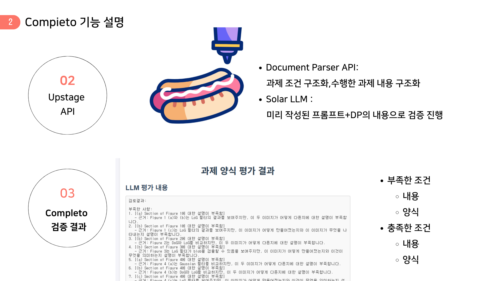

# Completo!
**AI 기반 과제 제출 양식 자동 검증 시스템**

**Languages**: [한국어](README.md) | [English](README_EN.md)

## 🗂️ 발표자료
[👉 발표자료(슬라이드 보기)](https://www.canva.com/design/DAGoctCK6vY/mVjrt25BcsVvaDrliRBNbQ/view?utm_content=DAGoctCK6vY&utm_campaign=designshare&utm_medium=link2&utm_source=uniquelinks&utlId=h99d67cfbba)

[👉 데모 영상(Youtube)](https://www.youtube.com/watch?v=PIF_YogB2ZA)

## 📌 개요


Completo는 "Complete it, Perfect it, COMPLETO it!"이라는 비전으로 시작된 AI 기반 문서 포맷 검증 서비스입니다. 
완벽한 핫도그를 만들기 위해 모든 재료가 필요하듯이, 완벽한 과제를 위해서는 내용뿐만 아니라 양식도 중요합니다.

**핵심 가치**
- 학생들의 사소한 양식 실수로 인한 감점 방지
- 교수들이 내용 평가에 집중할 수 있도록 지원
- 부산대학교 PLATO 등 학교 LMS와 연동된 실시간 양식 검증

학생은 제출 전 파일명, 확장자, 문서 내 항목 등 세부 조건을 실시간으로 확인하고 오류를 즉시 수정할 수 있습니다.

## 🎯 문제 정의 및 솔루션

**문제 상황**
- 학생들의 양식 실수로 인한 빈번한 감점
- 교수자의 반복적인 양식 검토 부담
- 늦은 피드백으로 인한 실수 반복

**Completo의 해결책**
- 제출 전 오류 사전 차단 - 제출 전 스스로 조건 준수 여부를 점검해 학생은 불필요한 감점을 방지
- 평가 품질 향상 - 조건 검토 자동화로 사람이 평가하면서 있을 수 있는 실수 방지
- 학생, 교수자 모두의 효율성 향상 - 늦거나 부족한 피드백으로 인해 반복되는 문제 해결해 업무 효율성 향상


## 💼 비즈니스 모델 및 임팩트

**수익 모델**
- 대학 라이선스: 연간 구독 방식 B2B 모델
- SaaS 서비스: 사용량 기반 과금 체계
- 기업 확장: 문서 검증 솔루션과 보안 기능 확장

**시장 분석**
- TAM: 국내 대학 400개교, 재학생 약 약 300만명
- 핵심 가치 : 교수 및 채점 조교의 양식 채점 부담 제거, 인건비 절감

**성과 목표**
- 양식 실수 감점 50% 감소
- 양식 검토 시간 80% 단축
- 시스템 정확도 95% 이상(100개 과제+정답지 테스트 기준)


## 🔧 기술 혁신

**핵심 차별화 요소**
- 기존:  프롬프트 기반 단순 템플릿 체커 vs **Completo**: 자연어 이해 기반 검증
- LLM + Document Parser + Agent Workflow 통합 파이프라인
- 실시간 맥락 기반 조건 해석

**Upstage API 활용**

 **Upstage Document Parser**
- 교수자가 작성한 한글이나 영어 과제 제출 조건을 LLM이 이해할 수 있는 포맷으로 변환.
- 학생이 작성한 과제 파일도 구조화된 데이터로 변환해 멀티모달 요소 종합 분석. 
멀티모달 처리: 텍스트, 이미지, 표 등 다양한 문서 요소 분석

 **Solar LLM**
- 커스텀 프롬프트 엔지니어링을 통해 추출된 조건을 바탕으로 판단
- 실제 제출물이 조건과 부합하는지 정교하게 피드백 생성


## 🚀 주요 기능

- ✨ **과제 조건 자동 파싱 및 구조화**
  - PLATO 등 LMS에 업로드된 제출 조건을 Document Parser가 자동 분석
- 자연어 조건을 구조화된 검증 기준으로 변환
- 지원 형식: PDF, DOCX 등

- ✨ **제출물 자동 검증**
 - 학생 제출 파일을 Document Parser로 구조 분석 후 Solar LLM이 조건 부합성 실시간 판단
- 검증 항목: 표지 유무, 이름/학번 명시, 페이지 수 제한 등
- 즉시 피드백으로 제출 전 오류 수정 가능
    
- ✨ **조건 해석 불확실성 안내**
- 조건 해석이 모호한 경우 추가 확인 필요 사항을 명확히 안내
- 오해석으로 인한 제출 오류 사전 예방

- ✨ **피드백**
- 부족한 조건과 충족한 조건 순서로 어느 부분이 틀렸는지 구체적으로 제시
- 사용자가 과제를 개선하거나 채점하는데 구체적인 기준으로 삼을 수 있음

## 🖼️ 데모

**실제 테스트 케이스**


- 과제명: "Introduction to Computer Vision: Assignment 4"
- 검증 항목: 표지 유무, 학번/이름 명시, 섹션별 설명 완성도
- 결과: 6개 부족 사항 발견 및 구체적 개선 방안 제시

**시나리오 1: 학생 관점**
1. 과제 파일 업로드
2. 실시간 검증 결과 확인
3. 오류 수정 후 재검증
4. 완벽한 과제 제출

**시나리오 2: 교수 관점**
1. 과제 조건 업로드
2. 자동 구조화 확인
3. 학생 제출물 자동 사전 검증
4. 내용 평가에 집중

### 🗺️ Future Roadmap

**확장 가능성**
- 기존 도메인 유지 시, Chain of Thought을 도입해 학생 맞춤형 개선 방안 및 채점 근거 기능 제공
- 도메인 확장시, RAG를 도입해 지식을 더욱 확장하여 컨텍스트로 활용. NGO/NPO 기관, 의료문서 등 전문적인 문서 및 보고서 양식 검증  

**단계별 발전 계획**

| Phase | 기간 | 목표 | 주요 내용 |
|-------|------|------|-----------|
| **Phase 1** | 6개월 | 기술 고도화 | CoT 시스템 도입으로 검증 정확도 98% 달성, 멀티언어 지원 (한/영/일/중) |
| **Phase 2** | 1-2년 | 시장 확장 | PLATO 공식 연동, 부산대 서비스 도전, RAG 도입(도메인 확장) |
| **Phase 3** | 3-5년 | 생태계 구축 | 한단계 나아가 공공기관 문서 검증 시스템 발전, AI 기반 문서 품질 개선 플랫폼 구축 |


## 🔬 기술 구현 요약

- **Document Parser(document-parse-250508)**
- **Solar LLM(solar-pro2-preview)**

## 🧰 기술 스택
- 사용 언어: TypeScript, Python
- 프레임워크: React, FastAPI, Vite

### 시스템 아키텍처


## 🔧 설치 및 사용 방법
### 프론트엔드
- cd frontend
- npm run dev
### 백엔드
- API_KEY=... 입력 (backend/.env/data.env)
- cd backend
- uv run fastapi run main.py

## 📁 프로젝트 구조
```sh
/
├── frontend                 # 프론트엔드 코드
│   ├── public/              # 정적 파일
│   ├── src/                 # 소스 코드
│   │   ├── assets/          # 이미지 및 기타 정적 자산
│   │   ├── components/      # 재사용 가능한 UI 컴포넌트
│   │   ├── pages/           # 페이지별 React 컴포넌트
│   │   ├── types/           # TypeScript 타입 정의
│   │   ├── App.tsx          # 메인 앱 파일
│   │   ├── index.css        # 글로벌 스타일
│   │   ├── main.tsx         # React 앱 진입점
│   │   └── vite-env.d.ts    # Vite 환경 타입 정의
│   ├── package.json         # 패키지 설정 및 의존성 관리
│   ├── tailwind.config.js   # Tailwind CSS 설정
│   ├── tsconfig.json        # TypeScript 설정
│   ├── vite.config.ts       # Vite 설정 파일
│   └── index.html           # HTML 템플릿
├── backend                  # 백엔드 코드
│   ├── .env/                # 환경 변수 파일
│   ├── app/                 # FastAPI 애플리케이션 모듈
│   │   ├── controllers/     # API 컨트롤러
│   │   ├── models/          # 데이터 모델 및 관련 파일
│   │   ├── routes/          # API 라우트 정의
│   │   ├── services/        # 비즈니스 로직 및 서비스
│   ├── temp/                 # 임시 파일 저장소
│   └── main.py              # FastAPI 애플리케이션 진입점
└── README.md                # 프로젝트 설명 문서
```
## 🧑‍🤝‍🧑 팀원 소개

| 이름    | 역할     | GitHub                                      |
|--------|---------|---------------------------------------------|
| 정성우   |   팀장   | https://github.com/qda-sw    |
| 안나연   |   팀원   | https://github.com/annaaa4701  |
| 정재원   |   팀원   | https://github.com/wolfura-ark  |
| 임승우   |   팀원   | https://github.com/ChopinBag  |

## 💡 참고 자료 및 아이디어 출처

* [Upstage Document Parse](https://www.upstage.ai/products/document-parse)
* [Upstage: Building end-to-end RAG system using Solar LLM and MongoDB Atlas](https://www.upstage.ai/blog/en/building-rag-system-using-solar-llm-and-mongodb-atlas)
* [PLATO 공식 문서](https://plato.pusan.ac.kr) 

