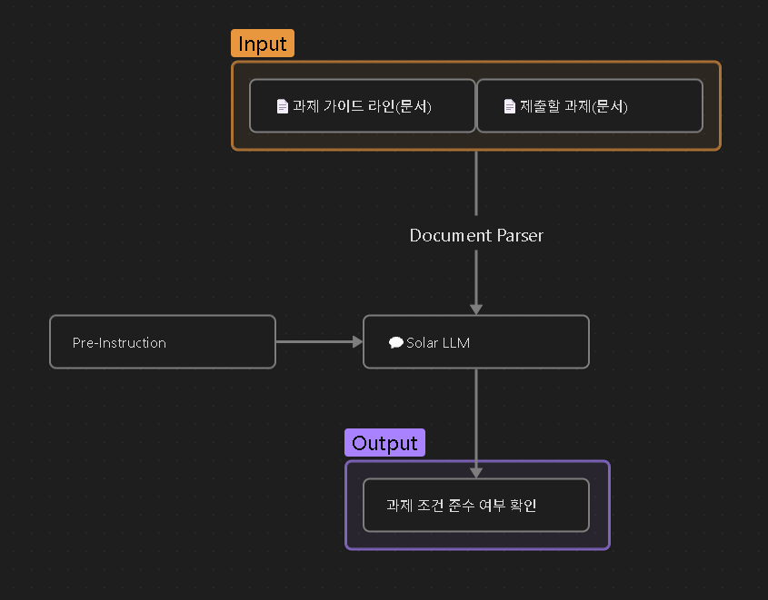

# Completo!
## 🗂️ 발표자료
[👉 발표자료(슬라이드 보기)](https://www.canva.com/design/DAGoctCK6vY/mVjrt25BcsVvaDrliRBNbQ/view?utm_content=DAGoctCK6vY&utm_campaign=designshare&utm_medium=link2&utm_source=uniquelinks&utlId=h99d67cfbba)

## 📌 개요

Completo는 "Complete it, Perfect it, COMPLETO it!"이라는 비전으로 시작된 AI 기반 문서 포맷 검증 서비스입니다. 마치 완벽한 핫도그를 만들기 위해 모든 재료가 필요하듯이, 완벽한 과제를 위해서는 내용뿐만 아니라 양식도 중요합니다. 학생들이 사소한 양식 실수로 감점당하는 일을 방지하고, 교수들이 내용 평가에 집중할 수 있도록 돕는 것이 저희의 목표입니다.

Completo는 부산대학교 PLATO 등 학교 서버에서 학생이 제출하는 과제가 평문으로 제시된 제출 양식을 정확히 지켰는지 자동으로 검사해줍니다. 학생은 제출 전, 파일명·확장자·문서 내 항목 등 세부 조건을 실시간으로 확인하고 오류를 바로잡을 수 있어, 사소한 실수로 인한 감점을 방지할 수 있습니다.

## 🎯 문제 정의 및 기대 효과

### 문제 정의
- 학생들은 교수자가 제시한 과제 제출 조건을 놓치거나 잘못 해석해 감점당하는 일이 빈번합니다.
- 파일명, 확장자, 문서 내 특정 형식(예: 표지 유무, 장수 제한 등) 등 세부 조건을 직접 확인하는 것은 번거롭고 실수하기 쉽습니다.
- 제출된 과제 제출 조건을 채점하는 사람도 양식 오류를 하나하나 지적하고 채점하기는 시간이 오래 걸리기 때문에 빠른 피드백이 어렵고 그 결과 실수가 반복되는 일이 많습니다.

### 중요성 및 필요성
- 학생은 불필요한 감점을 방지하고, 제출 전 스스로 조건 준수 여부를 점검할 수 있습니다.
- 과제의 작은 실수들을 확인하면 고칠 수 있지만, 늦거나 아예 없는 피드백으로 고칠 수 있는데 반복되는 실수를 방지할 수 있습니다. 
- 반복적이고 소모적인 양식 확인 작업을 자동화하여, 자기주도적 학습과 과제 제출의 효율성을 높입니다.

### 기대 효과
- 학생이 제출 전 조건 준수 여부를 실시간으로 확인, 감점 방지
- 과제 제출 시스템(PLATO 등)과 연동하여 자동 양식 검증 및 통과 여부 안내
- 즉시 피드백으로 양식 오류 사전 차단, 교수의 양식 채점 부담 완전 제거
- 학교 전체의 과제 관리 효율성 향상

## ✅ Upstage API 활용

- **Upstage Document Parser**: 교수자가 작성한 한글이나 영어 과제 제출 조건을 LLM이 이해할 수 있는 포맷으로 변환하고, 학생이 업로드한 과제 파일 역시 분석하여 구조화합니다.
- **Solar LLM**: 추출된 조건을 바탕으로 맥락에 기반하여, 실제 제출물이 조건과 부합하는지 정교하게 판단합니다.

## 🚀 주요 기능

- ✨ **과제 조건 자동 파싱 및 구조화**
  - 교수자가 PLATO 등에 올린 제출 조건을 Document Parser가 자동으로 파싱하여, 문서 내 명시 항목 등 세부 조건을 추출합니다.
  - **장점**: 자연어 조건을 이해하고 구조화, 과제 파일 제출 전 과제 구조 이해
  - 지원 양식 : docx, pdf 등

- ✨ **제출물 자동 검증**
  - 학생이 제출할 파일(docx, pdf 등)을 업로드하면, Solar LLM이 추출된 조건과 실제 파일을 비교해 부합 여부를 실시간으로 피드백합니다.
  - 예) 표지 유무, 이름/학번 명시, 장수 제한 등
  - **장점**: 제출 전 오류 즉시 확인, 감점 방지
    
- ✨ **조건 해석 불확실성 안내**
  - 조건 해석이 모호한 경우, 추가 확인이 필요함을 학생에게 안내하여, 제출 오류를 예방합니다.

## 🖼️ 데모
- **시나리오**
- **Before**: 교수가 수작업 양식 체크 → **After**: AI 자동 검증
- **Before**: 학생이 감점 후 깨달음 → **After**: 제출 전 실시간 교정
- **Before**: 반복적 양식 실수 → **After**: 실수 사전 방지, 이후 과제 품질 개선

## 🔬 기술 구현 요약

- **Document Parser(document-parse-250508)**
- **Solar LLM(solar-pro2-preview)**

## 🧰 기술 스택
- 사용 언어: TypeScript, Python
- 프레임워크: React, FastAPI, Vite

### 시스템 아키텍처


## 🔧 설치 및 사용 방법
### 프론트엔드
- cd frontend
- npm run dev
### 백엔드
- API_KEY=... 입력 (backend/.env/data.env)
- cd backend
- uv run fastapi run main.py

## 📁 프로젝트 구조
```sh
/
├── frontend                 # 프론트엔드 코드
│   ├── public/              # 정적 파일
│   ├── src/                 # 소스 코드
│   │   ├── assets/          # 이미지 및 기타 정적 자산
│   │   ├── components/      # 재사용 가능한 UI 컴포넌트
│   │   ├── pages/           # 페이지별 React 컴포넌트
│   │   ├── types/           # TypeScript 타입 정의
│   │   ├── App.tsx          # 메인 앱 파일
│   │   ├── index.css        # 글로벌 스타일
│   │   ├── main.tsx         # React 앱 진입점
│   │   └── vite-env.d.ts    # Vite 환경 타입 정의
│   ├── package.json         # 패키지 설정 및 의존성 관리
│   ├── tailwind.config.js   # Tailwind CSS 설정
│   ├── tsconfig.json        # TypeScript 설정
│   ├── vite.config.ts       # Vite 설정 파일
│   └── index.html           # HTML 템플릿
├── backend                  # 백엔드 코드
│   ├── .env/                # 환경 변수 파일
│   ├── app/                 # FastAPI 애플리케이션 모듈
│   │   ├── controllers/     # API 컨트롤러
│   │   ├── models/          # 데이터 모델 및 관련 파일
│   │   ├── routes/          # API 라우트 정의
│   │   ├── services/        # 비즈니스 로직 및 서비스
│   ├── temp/                 # 임시 파일 저장소
│   └── main.py              # FastAPI 애플리케이션 진입점
└── README.md                # 프로젝트 설명 문서
```
## 🧑‍🤝‍🧑 팀원 소개

| 이름    | 역할     | GitHub                                      |
|--------|---------|---------------------------------------------|
| 정성우   |   팀장   | https://github.com/qda-sw    |
| 안나연   |   팀원   | https://github.com/annaaa4701  |
| 정재원   |   팀원   | https://github.com/wolfura-ark  |
| 임승우   |   팀원   | https://github.com/ChopinBag  |

## 💡 참고 자료 및 아이디어 출처

* [Upstage Document Parse](https://www.upstage.ai/products/document-parse)
* [Upstage: Building end-to-end RAG system using Solar LLM and MongoDB Atlas](https://www.upstage.ai/blog/en/building-rag-system-using-solar-llm-and-mongodb-atlas)
* [PLATO 공식 문서](https://plato.pusan.ac.kr)
